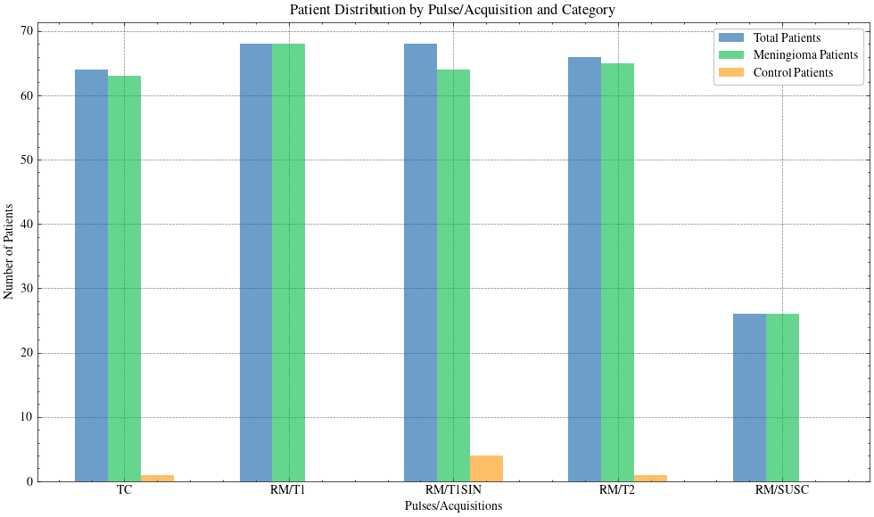

# Data

## Raw data

The data obtained from the Regional Hospital of Málaga is provided in a format where each patient has two primary medical imaging modalities: **Magnetic Resonance Imaging (MRI) and Computed Tomography (CT)**. Each MRI scan is further divided into four different pulse sequences: T1 (T1 Weighted), T1-SIN (T1 Spin Echo), T2 FLAIR, and SUSC (Susceptibility-Weighted Imaging). It is important to note that, irrespective of the patient's medical condition, some patients may lack the SUSC sequence. This absence is often attributed to the clinical judgment of the medical personnel, who may have deemed the SUSC sequence unnecessary for the patient's diagnosis or treatment.

```bash
Meningioma
├── Patient_1/
│   ├── RM/
│   │   ├── SUSC/
│   │   │   ├── RM_Image.nrrd
│   │   │   └── Segmentation.nrrd
│   │   ├── T1/
│   │   │   └── *
│   │   ├── T1SIN/
│   │   │   └── *
│   │   └── T2/
│   │       └── *
│   └── TC/
│       ├── TC_Image.nrrd
│       └── Segmentation.nrrd
├── Patient_2/
├── (...)
└── Patient_N/
```

## Dataset by Image Format

The first step to ensure the clarity and legibility of the data is to transform the raw data into a new dataset format, **where the root directory for each patient is organized by image type**. Convolutional Neural Networks (CNNs) will operate on a single image type—though in some cases, the co-registration of multiple image formats may be permitted. By organizing the data based on image format, we can optimize the subsequent transformation into the dataset format required by the CNN.

```bash
Meningioma_Transformed
├── RM/
│   ├── SUSC/
│   │   ├── Patient_1/
│   │   │   ├── SUSC_P1.nrrd
│   │   │   └── SUSC_P1_seg.nrrd
│   │   ├── (...)
│   │   └── Patient_N/
│   ├── T1/
│   │   ├── Patient_1/
│   │   │   ├── T1_P1.nrrd
│   │   │   └── T1_P1_seg.nrrd
│   │   ├── (...)
│   │   └── Patient_N/
│   ├── T1SIN/
│   │   ├── Patient_1/
│   │   │   ├── T1SIN_P1.nrrd
│   │   │   └── T1SIN_P1_seg.nrrd
│   │   ├── (...)
│   │   └── Patient_N/
│   └── T2/
│       ├── Patient_1/
│       │   ├── T2_P1.nrrd
│       │   └── T2_P1_seg.nrrd
│       ├── (...)
│       └── Patient_N/
└── TC/
    ├── Patient_1/
    │   ├── TC_P1.nrrd
    │   └── TC_P1_seg.nrrd
    ├── (...)
    └── Patient_N/
```

## Data Specifications

Once the dataset has been transformed to this adquisition-based folder hierarchy, we may extract the necessary information to determine the amount of segmentations and patients that we can count for in each pulse/adquition.



