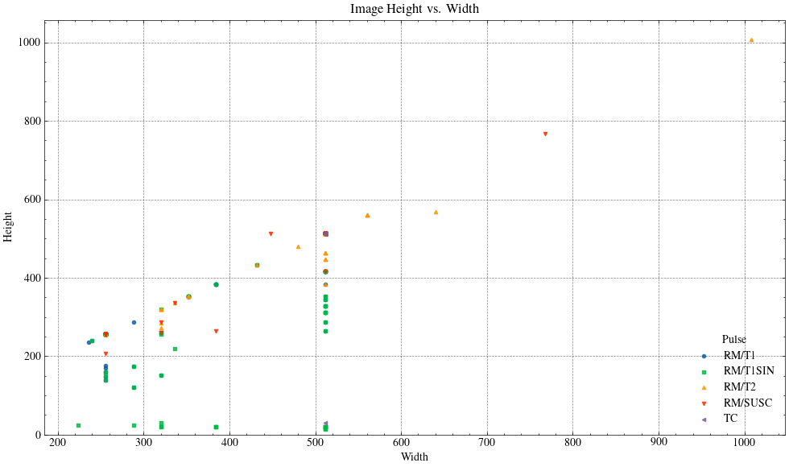
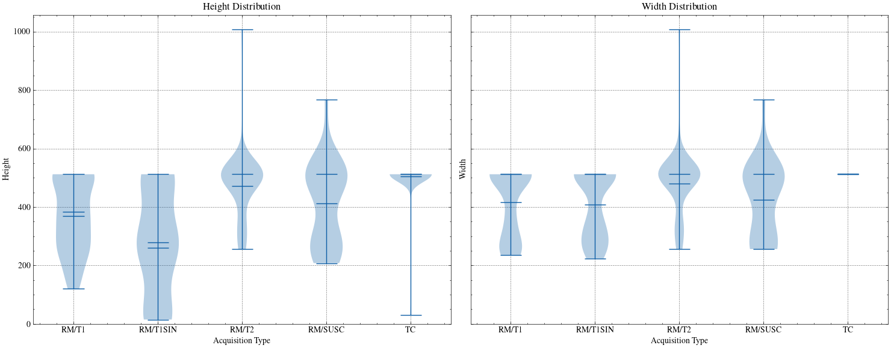
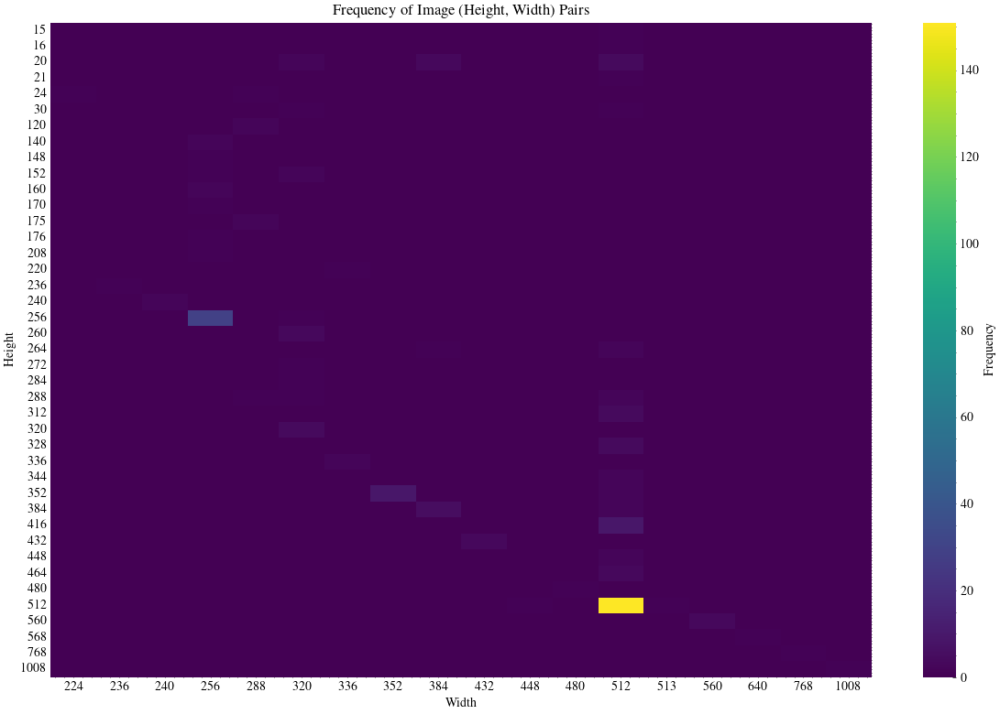

# Data

## Raw data

The data obtained from the Regional Hospital of Málaga is provided in a format where each patient has two primary medical imaging modalities: **Magnetic Resonance Imaging (MRI) and Computed Tomography (CT)**. Each MRI scan is further divided into four different pulse sequences: T1 (T1 Weighted), T1-SIN (T1 Spin Echo), T2 FLAIR, and SUSC (Susceptibility-Weighted Imaging). It is important to note that, irrespective of the patient's medical condition, some patients may lack the SUSC sequence. This absence is often attributed to the clinical judgment of the medical personnel, who may have deemed the SUSC sequence unnecessary for the patient's diagnosis or treatment.

```bash
Meningioma
├── Patient_1/
│   ├── RM/
│   │   ├── SUSC/
│   │   │   ├── RM_Image.nrrd
│   │   │   └── Segmentation.nrrd
│   │   ├── T1/
│   │   │   └── *
│   │   ├── T1SIN/
│   │   │   └── *
│   │   └── T2/
│   │       └── *
│   └── TC/
│       ├── TC_Image.nrrd
│       └── Segmentation.nrrd
├── Patient_2/
├── (...)
└── Patient_N/
```

## Dataset by Image Format

The first step to ensure the clarity and legibility of the data is to transform the raw data into a new dataset format, **where the root directory for each patient is organized by image type**. Convolutional Neural Networks (CNNs) will operate on a single image type—though in some cases, the co-registration of multiple image formats may be permitted. By organizing the data based on image format, we can optimize the subsequent transformation into the dataset format required by the CNN.

```bash
Meningioma_Transformed
├── RM/
│   ├── SUSC/
│   │   ├── Patient_1/
│   │   │   ├── SUSC_P1.nrrd
│   │   │   └── SUSC_P1_seg.nrrd
│   │   ├── (...)
│   │   └── Patient_N/
│   ├── T1/
│   │   ├── Patient_1/
│   │   │   ├── T1_P1.nrrd
│   │   │   └── T1_P1_seg.nrrd
│   │   ├── (...)
│   │   └── Patient_N/
│   ├── T1SIN/
│   │   ├── Patient_1/
│   │   │   ├── T1SIN_P1.nrrd
│   │   │   └── T1SIN_P1_seg.nrrd
│   │   ├── (...)
│   │   └── Patient_N/
│   └── T2/
│       ├── Patient_1/
│       │   ├── T2_P1.nrrd
│       │   └── T2_P1_seg.nrrd
│       ├── (...)
│       └── Patient_N/
└── TC/
    ├── Patient_1/
    │   ├── TC_P1.nrrd
    │   └── TC_P1_seg.nrrd
    ├── (...)
    └── Patient_N/
```

## Data Specifications

Once the dataset has been transformed to this adquisition-based folder hierarchy, we may extract the necessary information to determine the amount of segmentations and patients that we can count for in each pulse/adquition.


### Image Resolution

Standardizing the image size across the dataset normalizes the model’s input data, ensuring consistent input conditions and yielding more objective results in brain tumor segmentation and characterization. To achieve this goal, a statistical analysis of the image resolution within the dataset was conducted, yielding the following results.

### Height and Width as a continous variable





By plotting the height and width using a kernel density scatter plot, we can identify the numeric intervals within which the image sizes fall. This distribution is further illustrated using a box plot, which highlights the degree of variability across different acquisition formats. As observed, only the CT images are fully standardized, with a resolution of (512x512). In contrast, for the other MRI sequences, image sizes range approximately from (512x512) to (256x256).

### (Height, Width) pairs analysis




These plots further reinforce the conclusions drawn from the previous analysis of image resolution. The majority of images have a resolution of (512x512), followed by (256x256) and (416x512).

The YOLO model family archieves a flexibility in term of input image size by employing layers that inherently do not required fixed-size inputs, this means that the network accepts images of varying dimensions by accepting any size that is a multiple of the network's stride.

> "The resizing process during training and prediction does indeed use `cv2.resize` with linear interpolation to adjust the image to the specified `imgsz`, without padding. This ensures that the aspect ratio is maintained by scaling the image to fit within the defined size constraints."

Given the need to control the process of image resizing and rescaling, the chapter 'Dimensionality Standardization' will be dedicated to exploring the various resizing methods that can be applied to medical imaging and evaluating their effectiveness for this specific problem.
