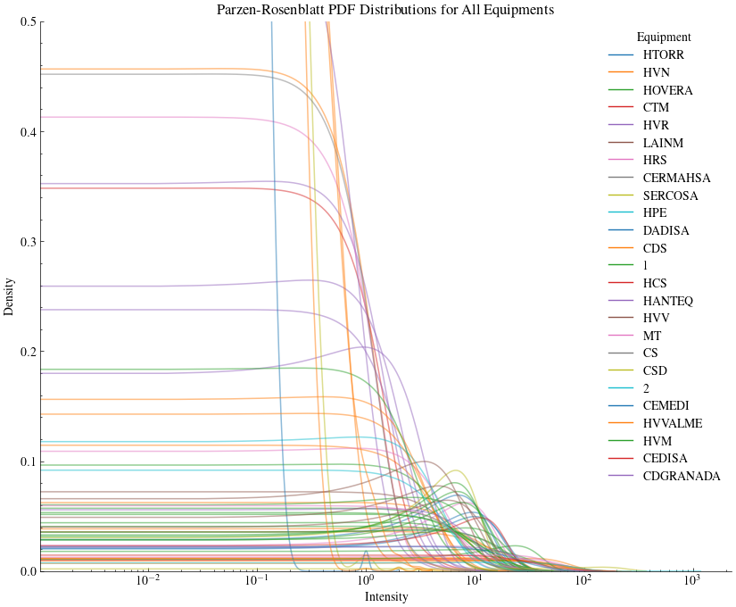
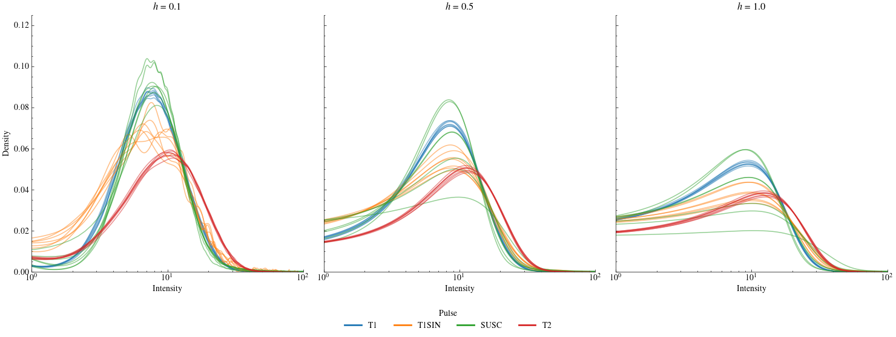
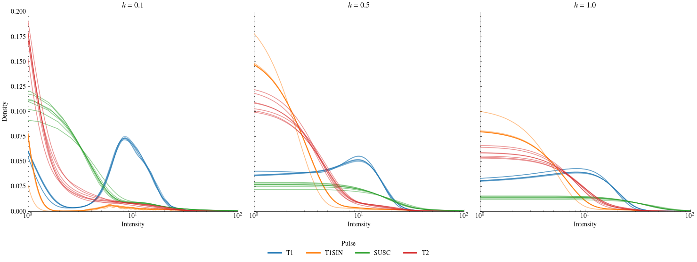
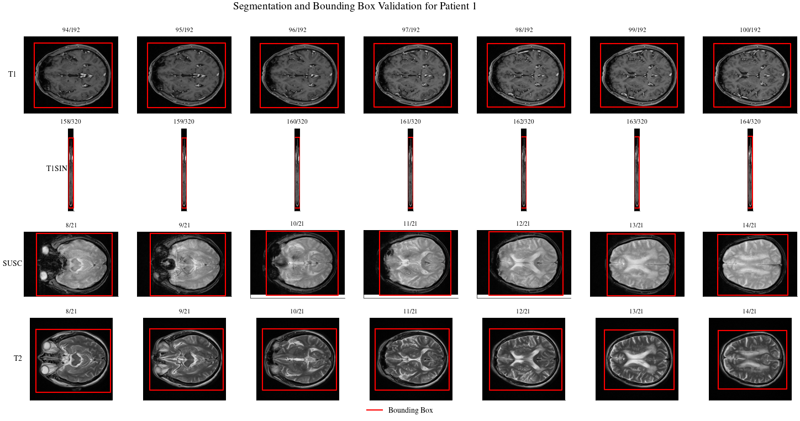
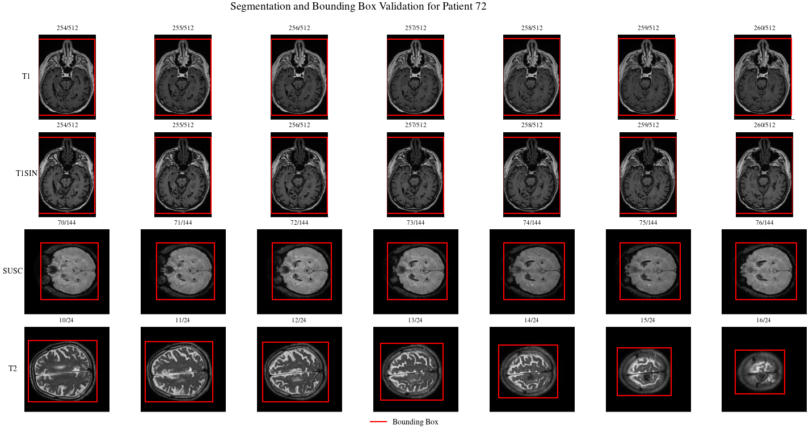

# Statistical Noise Modelling in Magnetic Resonance Imaging for the Meningioma Dataset 

## Methodology

This is the documentation of the experiments conducted to model background noise in MRI images with the aim to replicate this noise in the padding pixels of resized images. The experiments conducted in during this stages of the creation of the **Meningioma** dataset will be documented to publish an academic paper.  

The main objective is to determine if the *non-parametrized Parzen-Rosenblatt sliding window* method can outperform traditional methods like *Rice distribution*, and the *Non-Central $\chi$* distribution **(*)**, as well as other SOTA models in the modelling of the Probability Mass Distribution (PMF) of the Meningioma MR images.

Our main Research Questions (*RQ*) are:

  - **RQ1**. Could the Parzen-Rosenblatt KDE method outperform the traditional statistical noise-modelling models?
  - **RQ2**. Could the Parzen-Rosenblatt KDE method outperform other SOTA MRI noise modelling models, like the ones proposed by S.Ajá-Fernández et al. (1)?

Taking the theoretical Rician distribution as the baseline, we will train a model that aims to predict the PDF of this background noise using the Parzen-Rosenblatt sliding window method.

Fixing a pulse, for each patient inside that pulse, we will select a set of images from each patient, focusing on $2 \times N + 1$ symmetrical slices centered around the middle slice of each study. We extract background pixels from these slices to form training and testing datasets for model development and evaluation.

Hyperparameter tuning is performed for both models to optimize the noise emulation. For the Rician distribution, we adjust the mean noise intensity parameter, $\sigma_{Rice}$, while for the Parzen-Rosenblatt model, we tune the bandwidth parameter, $h$.

To assess the quality of the noise modeling, we evaluate the similarity between the predicted and actual PDF of the background noise using two validation metrics: *Bhattacharyya's Distance* and *Kullback-Leibler's Divergence*.

This procedure is considered a multi-objective optimization problem, therefore the results will be presented using a *Pareto front*. By plotting two data series, one corresponding to the optimization of $\sigma_{Rice}$ (Rician Distribution) and the other representing the optimization of $h$ (Parzen-Rosenblatt KDE), the most optimal value for each data series will be conformed by the minimum value for both validation metrics (X-axis for *Bhattacharyya's Distance* and Y-axis for *Kullback-Leibler's Divergence*).

**(*)** The nc-$\chi$ distribution is the same as the $\sigma = 1$ Rice distribution for $\lambda = 2$ degrees of freedom. 

### Previous studies made 

*Why model the noise for each patient and pulse?*

By applying the Parzen-Rosenblatt KDE method with $h=1$ to the patient's images and plotting the results taking into accound which machine was used to generate that image, we could observe that the noise distribution among the different equiment used for constructing the images is not uniform, meaning that the noise distribution does not depend on the equiment used.

*Why model the noise for each patient-pulse pair?*

We studied the PDF obtained with different $h$ values, training the model with the central slices of the patient, and coloring the results using the pulse that the images belonged to.

As we can see, the noise PDF highly depends on the $h$ value, therefore the relevance of this study. Notice that the PDF also varies depending on the pulse, which highly surprised us, since we were expecting minimal change in the PDF values between slices. This variance seems to be patient-dependant, since for P1, pulses T1 and T2 seem to be more stable, while P72 shows higher stability for T1 exclusively.

*Is it possible that a poor detection method of the intracraneal section could be the cause of the variance in the PDF across different slices?*

This was considered the main cause of this variance. Nevertheless, visually inspecting the results of the detection algorithm used to extract the background noise data that would be fed to the Parzen-Rosenblatt model, we can notice that this detection is almost perfect for each slice.

## References
1. AJA-FERNÁNDEZ, Santiago; TRISTÁN-VEGA, Antonio. A review on statistical noise models for magnetic resonance imaging. LPI, ETSI Telecomunicacion, Universidad de Valladolid, Spain, Tech. Rep, 2013.