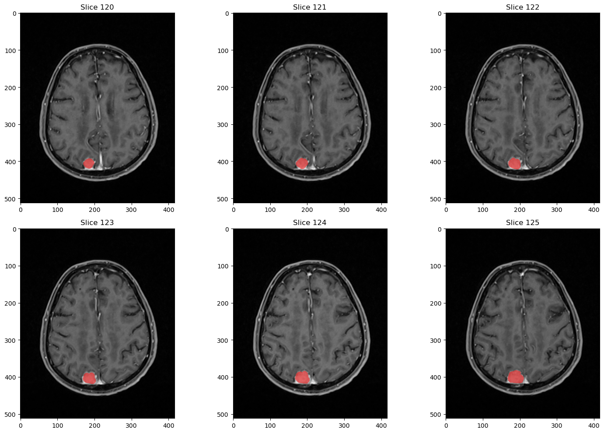

# Raw data pre-processing: Image Coregistration

> Start date: 29-07-24

## Problem

Upon inspection of the raw images received from the 'Hospital Universitario de Málaga', it was found that the images, due to the acquisition machine used, had different dimensions along the x,y and z axes. This was due to the fact that the different RM machines had different resolutions along each axis.

The main problems found were:

- There is a significant difference between the **number of segmentation slices and the RM images for some patients**. (e.g. Patient 70 for the T2 pulse, which had only 23 adquisition images, but 192 segmentation slices).
- The **resolution (x,y dim) of the images and segmentations do not match for most of the raw data** acquired for the same patient. (e.g. Patient 70 for the T2 pulse, which had a segmentation mask with x=416 and y=512, but the image slices had x=320 and y=320).

## Objective

The main objective of this section is to serve as a guide for the pre-processing of raw RM image data acquired from the 'Hospital Regional de Málaga', in order to obtain a common dimensionality for all the images using different **image coregistration techniques**.

This document will serve as a way to document the process of correcting the raw data dimensionality, and will be updated as the process is completed.

## Correct raw data dimensionality example

The following example illustrates the goal of this section by plotting several slices of raw data that came in the correct format. The segmentation mask and the image are both the same dimensions and have the same amount of slices, allowing us to compare the two images and feed them to a Neural Network (NN) to train it.



## Raw data dimensionality correction

- [X] Check the different fields in the `.nrrd` headers of problematic files, looking for any of these fields that could provide a hint of how to easily correlate the slices and resolution of the images.
- [X] Try using the `SimpleITK` or `Scipy.ndimage` libraries to perform a spatial correlation of the images in order to solve the resolution problem.
- [X] Explore the `.mrml` file within the same directory as the `.nrrd` files, to check if it contains any useful information that realtes the image slices to the segmentation masks.
- [X] Find a way to export the images from 3D-Slicer into a format that combines both the original volume and the segmentation mask, so that the (x,y,z) dimensions of the images and the segmentation masks match.

## Results

### Successful Approachs

The `.seg.nrrd` format only saved the segmentation mask, but did not contain the references to the original volume. This causes that, for small and really located tumours, the (x,y) resolution of the image was smaller than the original volume, while not located tumours, cause the reverse effect by having a higher resolution than the image slices.

The problem was finally solved by exporting all the segmentation files using 3D-Slicer in the `.nrrd` format, which immediatly solved the problem by matching (x,y,z) dimensions of the mask with its corresponding image.

### Failed Approachs

- The `SimpleITK` library was able to perform a spatial correlation of the images, however, it did not work. This problem was due to the fact that the headers in the segmentation mask file (`.seg.nrrd`) did not match the headers in the file containing the original volumnes, making impossible to perform the spatial correlation without a deep analysis of the spatial correlation algorithm. In the end, this approach to the problem was not possible due to the fact that we had incorrect data from the beginning.

```python
import os
import nrrd
import numpy as np
import matplotlib.pyplot as plt
from scipy.ndimage import affine_transform

# Read images and masks
images, header_slices = nrrd.read(os.path.join(t1, '8 Sag CUBE T1 GAD.nrrd'))
masks, header_masks = nrrd.read(os.path.join(t1, 'Segmentation.seg.nrrd'))

print("Images shape: ", images.shape)
print("Masks shape: ", masks.shape)

# Spatial image info
image_space_directions = np.array(header_slices['space directions'])
image_space_origin = np.array(header_slices['space origin'])

# Spatial segmentation mask info
seg_space_directions = np.array(header_masks['space directions'])
seg_space_origin = np.array(header_masks['space origin'])

print("Image space directions:", image_space_directions)
print("Image space origin:", image_space_origin)
print("Segmentation space directions:", seg_space_directions)
print("Segmentation space origin:", seg_space_origin)

# Transformation matrix
transformation_matrix = np.linalg.inv(image_space_directions) @ seg_space_directions
offset = np.linalg.inv(image_space_directions) @ 
         (seg_space_origin - image_space_origin)

# Apply the transformation to segmentation with interpolation of order 0 (binary mask)
transformed_masks = affine_transform(
    masks, transformation_matrix, offset=offset, 
    output_shape=images.shape, order=0, mode='constant', cval=0
)
```


The formula for transforming the segmentation coordinates to match the image coordinates is given by:

$$ \mathbf{y} = \mathbf{T} \mathbf{x} + \mathbf{o} $$

where:

- $\mathbf{y}$ is the transformed coordinate vector in the image space.
- $\mathbf{T}$ is the transformation matrix.
- $\mathbf{x}$ is the original coordinate vector in the segmentation space.
- $\mathbf{o}$ is the offset vector.

1. **Transformation Matrix ($\mathbf{T}$)**:

   - $\mathbf{A}_{\text{image}}$: The space directions matrix of the MRI image. This matrix describes how the image voxel coordinates are mapped to world coordinates.
   - $\mathbf{A}_{\text{seg}}$: The space directions matrix of the segmentation. This matrix describes how the segmentation voxel coordinates are mapped to world coordinates.
   - $\mathbf{A}_{\text{image}}^{-1}$: The inverse of the image space directions matrix. This matrix maps world coordinates back to image coordinates.

   Therefore, the transformation matrix $\mathbf{T}$ effectively maps the segmentation voxel coordinates (in segmentation space) to the image voxel coordinates (in image space) by:
   - First transforming the segmentation coordinates to world coordinates using $\mathbf{A}_{\text{seg}}$.
   - Then transforming the world coordinates to image coordinates using $\mathbf{A}_{\text{image}}^{-1}$.

$$ \mathbf{T} = \mathbf{A}_{\text{image}}^{-1} \mathbf{A}_{\text{seg}} $$

2. **Offset ($\mathbf{o}$)**:

   - $\mathbf{o}_{\text{seg}}$: The origin of the segmentation in world coordinates.
   - $\mathbf{o}_{\text{image}}$: The origin of the MRI image in world coordinates.
   - $\mathbf{o}_{\text{seg}} - $\mathbf{o}_{\text{image}}$): The difference in origin between the segmentation and the image in world coordinates.

   The offset vector $\mathbf{o}$ adjusts for any translation between the segmentation origin and the image origin by converting the world coordinate translation to image coordinate translation using $\mathbf{A}_{\text{image}}^{-1}$.

$$ \mathbf{o} = \mathbf{A}_{\text{image}}^{-1} (\mathbf{o}_{\text{seg}} - \mathbf{o}_{\text{image}}) $$

The final formula for transforming the segmentation to align with the image is:

$$ \mathbf{y} = \mathbf{A}_{\text{image}}^{-1} \mathbf{A}_{\text{seg}} \mathbf{x} + \mathbf{A}_{\text{image}}^{-1} (\mathbf{o}_{\text{seg}} - \mathbf{o}_{\text{image}}) $$


- Using the `xml.tree` python module, we were able to extract the `.mrml` file from the directory, and print it in order to explore the different xml nodes, however, in the end, we were not able to find any useful information that could relate the image slices to the segmentation instances.
